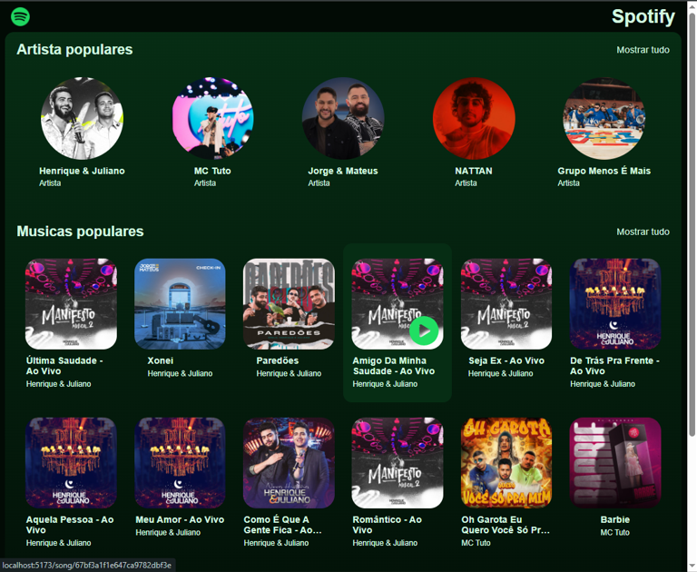

## 🎵 Plataforma de Streaming de Música (Projeto Fullstack)

Este projeto foi desenvolvido durante minha jornada como desenvolvedor fullstack na **Hashtag Treinamentos**, entre fevereiro e março de 2025. Inspirado na interface e na usabilidade do Spotify, o objetivo foi criar uma plataforma responsiva e elegante para streaming de músicas.

---

## 🚀 Tecnologias Utilizadas
- **Frontend**: React.js
- **Backend**: Node.js com API REST
- **Banco de Dados**: MongoDB

---

## 📈 Funcionalidades Principais
- Navegação por artistas e músicas populares
- Interface responsiva e intuitiva
- Integração com banco de dados para busca eficiente

---

## 🌟 Funcionalidades Extras Implementadas
- 🎶 Transformação do grid de artistas para um layout em **lista flexível**
- 🎵 Lista **vertical de músicas**, mais elegante e fluida
- 🔀 Botão de **modo aleatório** no player de música

Essas funcionalidades foram implementadas como desafios pessoais, o que me proporcionou um grande aprendizado em responsividade e lógica de interatividade.

---

## 🚀 Possíveis Expansões Futuras
- Compartilhamento e criação de playlists personalizadas
- Seguir artistas favoritos
- Integração com a API oficial do Spotify
- Web scraping para dados dinâmicos e atualizações automáticas

---

## 📊 Competências Desenvolvidas
- React.js
- Node.js
- MongoDB
- Desenvolvimento Fullstack
- API REST
- Práticas modernas de responsividade

---
